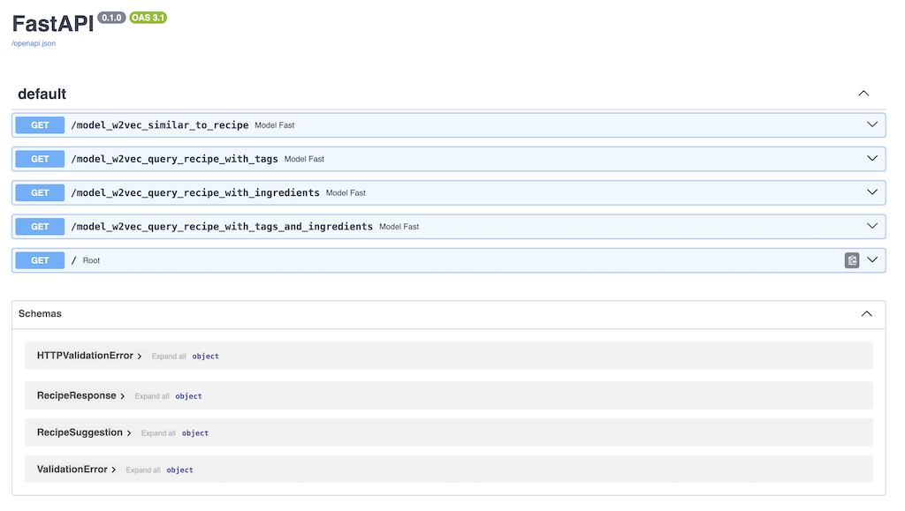
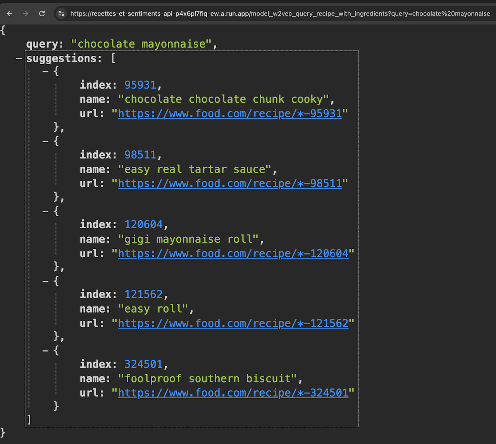
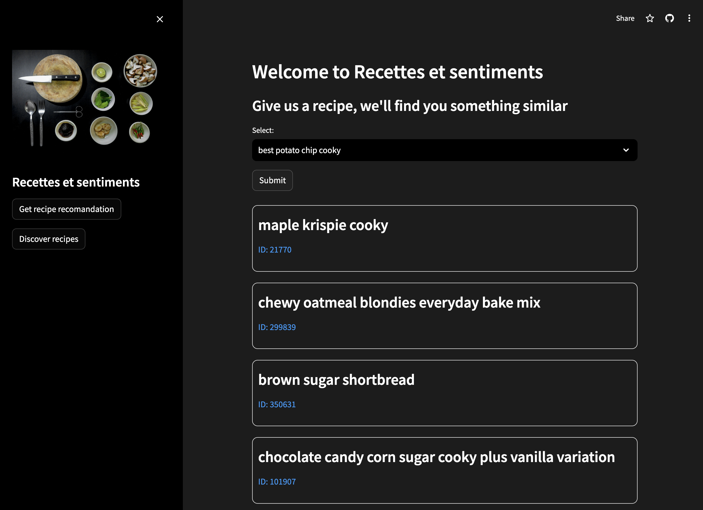
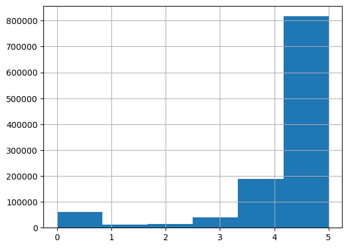
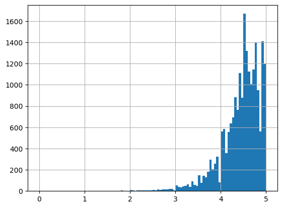

<!-- PROJECT SHIELDS -->
<!--
*** I'm using markdown "reference style" links for readability.
*** Reference links are enclosed in brackets [ ] instead of parentheses ( ).
*** See the bottom of this document for the declaration of the reference variables
*** for contributors-url, forks-url, etc. This is an optional, concise syntax you may use.
*** https://www.markdownguide.org/basic-syntax/#reference-style-links
-->
[![Contributors][contributors-shield]][contributors-url]
[![Forks][forks-shield]][forks-url]
[![Stargazers][stars-shield]][stars-url]
[![Issues][issues-shield]][issues-url]
[![MIT License][license-shield]][license-url]
[![LinkedIn][linkedin-shield]][linkedin-url1]
[![LinkedIn][linkedin-shield]][linkedin-url2]
[![LinkedIn][linkedin-shield]][linkedin-url3]


# recettes-et-sentiments

_Authors_
 - [Marie Anne](https://github.com/Nanouna)
 - [Théo](https://github.com/theorosen12)
 - [Thomas](https://github.com/mansonthomas-wagon)

## Description

This is the application project of the [Datascience & IA](https://www.lewagon.com/fr/remote/data-science-course) course, batch #1672 - April/June 2024

It uses the Kaggle [Food.com Recipes and Interactions](https://www.kaggle.com/datasets/shuyangli94/food-com-recipes-and-user-interactions) dataset.

The purpose of the project is to apply our learnings in a full project from training of a model to deployment in GCP on Cloud Run with a web interface.

The first goal is to predict the the user review score from the recipe description, using a Machine Learning algorithm.

The second goal is to recommend some recipes, first based on a recipe proximity, then based on a user prompt.

The third goal is to generate a brand new receipes from a list of key ingredients.
<p align="right">(<a href="#readme-top">back to top</a>)</p>

## Setup

### requirements

 - python 3.10.6
 - Tested on Windows(11) & MacOSX (intel/sonoma)
 - gcloud command line : https://cloud.google.com/sdk/docs/install
  - gcloud init
  - gcloud auth login
  - gcloud config set project PROJECT_ID (replace PROJECT_ID with your GCP project ID)

 ### steps

#### Cloning the repo and install dependencies

- git clone git@github.com:Nanouna/recettes-et-sentiments.git
- cd recettes-et-sentiments
- pyenv virtualenv recettes-et-sentiments
- pyenv local recettes-et-sentiments
- pip install --upgrade pip
- pip install -r requirements.txt
- pip install -e .
- sudo snap install yq (or brew install yq on mac)

#### Google Cloud Bucket Creation

- it's required even if the docker image is running locally, as the image will fetch
 models & data files on startup
- edit the Docker/.env.yaml & set BUCKET_URL & GCP_REGION
  - BUCKET_URL must start with https://storage.googleapis.com/, just add your bucket name after that
- ./setup-gcloud-bucket.sh

#### Training the model and store them on Google Cloud Bucket

- Upload the trained models & parquets to this bucket
  - run train_model.py, this will generate models & parquet :
    - python recettes-et-sentiments/api_model/train_model.py
  - you should get the following files in /tmp/data/ :
    - w2vec_model_tags.pkl
    - w2vec_df_tags.parquet
    - knn_model_tags.pkl
    - w2vec_model_ingredients.pkl
    - w2vec_df_ingredients.parquet
    - knn_model_ingredients.pkl
    - w2vec_model_col_concat.pkl
    - w2vec_df_col_concat.parquet
    - knn_model_col_concat.pkl
  - copy the files to the bucket
    - gsutil cp /tmp/data/* gs://your-bucket-name/

#### Docker : build & local testing

- edit the .env.yaml with the URL of the bucket and the list of file names
    uploaded to the bucket
- local testing
  - build the image with : ./docker-build.sh
  - run the image with : ./docker-run.sh
  - run the image and open a shell to debug : ./DockerDebug.sh

#### Docker : build & run on Google Cloud Run
- run on Google Cloud Run
  - edit Docker/.env.yaml and fill the variables
    - GCP_PROJECT_ID : your GCP project ID
    - GCP_REGION : your prefered region for the Cloud Run Deployemnt
  - ./setup-gcloud-artifcat-registry.sh :  setup the Google Cloud artificat registry (to be run only once)
  - ./docker-build-for-cloud-run.sh : build the docker image for Google Cloud Run and push it to Google Artificat Registry
  - ./gcloud-run.sh : deploy & run the image on Googel Cloud Run

#### check the API documentation

  - the ./gcloud-run.sh will print this last line :

    ex : Service URL: https://recettes-et-sentiments-api-p4x6pl7fiq-ew.a.run.app

    paste this URL + docs :  https://recettes-et-sentiments-api-p4x6pl7fiq-ew.a.run.app/docs to check the OpenAPI documentation



#### try out the APIs in your browser

  - replace the hostname in the following URL with your own Service URL :
  - recipe similar to an existing recipe

    https://recettes-et-sentiments-api-p4x6pl7fiq-ew.a.run.app/model_w2vec_similar_to_recipe?recipe_id=331985
  - recipe recommendantion based on tags

    https://recettes-et-sentiments-api-p4x6pl7fiq-ew.a.run.app/model_w2vec_query_recipe_with_tags?query=christmas%20gifts%20chocolate%20healthy
  - recipe recommendantion based on ingredients

    https://recettes-et-sentiments-api-p4x6pl7fiq-ew.a.run.app/model_w2vec_query_recipe_with_ingredients?query=chocolate%20mayonnaise
  - recipe recommendantion based on ingredients & tags

    https://recettes-et-sentiments-api-p4x6pl7fiq-ew.a.run.app/model_w2vec_query_recipe_with_tags_and_ingredients?query=christmas%20gifts%20chocolate%20healthy

    


# Check our Streamlit web application to interract with our API

 - see https://github.com/Nanouna/recettes-et-sentiments-streamlit

 

<p align="right">(<a href="#readme-top">back to top</a>)</p>

## Key Technologies used in this project

- Python
  - scikitlearn
  - Pandas / Numpy
  - gensim Word2Vec/FastText & nltk
  - uvicorn & fastapi

- Google Cloud Platform (GCP)
  - Cloud Run
  - IAM
  - Cloud Bucket
  - Clourd Artificat Registry
- Docker
- Jupyter Notebook

<p align="right">(<a href="#readme-top">back to top</a>)</p>

## Project logic

### 1. Rating prediction

Proposed use case: find recipes that be highly rated if they would received reviews. It would help chefs to better their recipes and help promote 'new' content on the website.

Baseline model:

```
from sklearn.metrics import root_mean_squared_error, mean_squared_error

local_review_path = "data/RAW_interactions.csv"
df_reviews = data.load_reviews(local_review_path)
local_recipe_path = "data/RAW_recipes.csv"
df_recipes = data.load_recipes(local_recipe_path)
y_merged = data.get_y(df_recipes, df_reviews)

number_review_threshold = 9
review_filter = y_merged[y_merged['count_rating']> number_review_threshold]

mean_rating_overall = review_filter['mean_rating'].mean()
y_true = review_filter['mean_rating']
y_pred = np.repeat(mean_rating_overall, len(review_filter))

rmse = root_mean_squared_error(y_true, y_pred)
mse = mean_squared_error(y_true, y_pred)

rmse, mse
```


__Results :__ (0.43713, 0.19108)

#### Preprocessing

First issue we enconter is that the ratings highly skewed toward the maximum value. It seems that the Americans are either enthousiastic about reviewing a recipe or don't do it at all. It is significantly the same if we look at the average rate by recipe.



Considering the objective, we need to have recipes that have enough reviews to be significant. We considered that having the normally distributed average rate by recipe is a good bases to have meanigful reviews we enough variation to have something to predict. Though we had to balance the cut to the dataset size with the significativity.

We selected a threshold of 10+ reviews by recipe.
We maintain 21399 recipes to train on with this following distribution. It's the smallest threshold that we still consider as a normally distributed distribution of average rating.



Numerical preprocessing

To handle excessive outliers while still maintaining some recipes exagerated features we mitigates the minutes and step by setting a minimum and a maximum
- minutes start at 5 and are capped at 130
- n_steps start at 1 and are capped at 40

We then applied a RobustScaler to the numerical beside the n_step and n_ingredients are they are already in a similar range to the rest. RobustSacler is ideal for our not always normal distribution with many outliers even if mitigated.

Text preprocessing

- start with basic word preprocessing (removing uppercase, numerical characters, ponctuation, english stopwords, lemmatizing by word types)
- adding custom stopword list to be removed selected from highest recurring words in the corpus if we felt that the words do not differentiate one recipe from another
- tags are pre handled to the preprocessing to remove recurring tags that add no additional sense value

- embedding of words 3 options tried : (using recipe name, description & ingredients)
  - CountVectorizer & TF IDF : with default setting we get a huge nubmer of columns, adjusting min_df,max_df we still get 15k columns and 26GB dataset.
    Training a LinearRegression model on this dataset exhaust the memorry resources of a high end computer with 64GB of RAM + 300GB of Swap
  - Using Word2Vec, where we create a vector(100,) per word and then compute the average vector so that it represents the recipe. Doing so it results in a much lower dataset.
    However, running a cross_validate(r2) gives a test_score of -5.1329

## Conclusion

  We were note able to explain the average score given by Food.com users to recipes from the name, description & ingredients using ML or Deep Learning.

  It was challenging anyway with scores 1,2,3 stars representing altogether only 6% of to users ratings, and it's even less considering that the 5.37% of 0 star rating (people didn't rate the recipe but left a comment)


  | Star | Rating (%) |
|------|------------|
| 5    | 72.09      |
| 4    | 16.55      |
| 0    |  5.37      |
| 3    |  3.61      |
| 2    |  1.25      |
| 1    |  1.13      |

We could have spent more time on the dataset and model, but we felt it was unlikely to have a different conculsion and trying other use case on this dataset was more compelling to us.


### 2. Recipe recommendation

### 3. Recipe generation

<p align="right">(<a href="#readme-top">back to top</a>)</p>

<!-- LICENSE -->
## License

Distributed under the MIT License. See `LICENSE` for more information.

<p align="right">(<a href="#readme-top">back to top</a>)</p>


<!-- MARKDOWN LINKS & IMAGES -->
<!-- https://www.markdownguide.org/basic-syntax/#reference-style-links -->
[contributors-shield]: https://img.shields.io/github/contributors/Nanouna/recettes-et-sentiments.svg?style=for-the-badge
[contributors-url]: https://github.com/Nanouna/recettes-et-sentiments/graphs/contributors
[forks-shield]: https://img.shields.io/github/forks/Nanouna/recettes-et-sentiments.svg?style=for-the-badge
[forks-url]: https://github.com/Nanouna/recettes-et-sentiments/network/members
[stars-shield]: https://img.shields.io/github/stars/Nanouna/recettes-et-sentiments.svg?style=for-the-badge
[stars-url]: https://github.com/Nanouna/recettes-et-sentiments/stargazers
[issues-shield]: https://img.shields.io/github/issues/Nanouna/recettes-et-sentiments.svg?style=for-the-badge
[issues-url]: https://github.comNanouna/recettes-et-sentiments/issues
[license-shield]: https://img.shields.io/github/license/Nanouna/recettes-et-sentiments.svg?style=for-the-badge
[license-url]: https://github.com/Nanouna/recettes-et-sentiments/blob/master/LICENSE.txt
[linkedin-shield]: https://img.shields.io/badge/-LinkedIn-black.svg?style=for-the-badge&logo=linkedin&colorB=555
[linkedin-url1]: https://linkedin.com/in/marie-anne-andr%C3%A9
[linkedin-url2]: https://linkedin.com/in/theorosen
[linkedin-url3]: https://linkedin.com/in/mansonthomas
